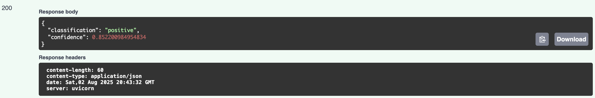

# FastAPI-based REST API for Serving Sentiment Analysis Model

## Table of Contents

- [About](#about)
- [Getting Started](#getting_started)
- [Usage](#usage)
- [Database Management](#database_management)
- [Contributors](#author)

## About <a name = "about"></a>

This project provides a **FastAPI-based REST API** that serves a **Hugging Face fine-tuned sentiment analysis model** for classifying news headlines.  

The API allows users to:

- Submit a news headline and receive its **sentiment classification** (Positive, Neutral, Negative).  
- Log each request in a **PostgreSQL database**.  
- Retrieve **historical request logs** for analysis or monitoring.  

It is containerized with **Docker** for ease of deployment and integrates **pgAdmin** for database management.

---

## Getting Started <a name = "getting_started"></a>

Follow these instructions to run the project locally for development and testing.

### Prerequisites

- **Python 3.9+**
- **Docker & Docker Compose**
- **Make** (optional, for using the provided Makefile)

---

### Installation & Setup

1. **Clone the repository:**

```bash
git clone https://github.com/dugerij/ulinzi_assess.git
cd ulinzi_assess
```

2. **Create an `.env` file by copying editing the `.env.example` file provided:**

All the required environmental variables and PgAdmin login details are provided here and can easily be modified.

3. **Build and start the application using Docker Compose:**

```bash
make up
```

This will:

- Build the FastAPI backend container

- Start PostgreSQL and pgAdmin

- Launch the sentiment API on http://localhost:8000

## Usage <a name = "usage"></a>

```bash
curl -X POST "http://localhost:8000/predict" \
     -H "Content-Type: application/json" \
     -d '{"text": "Stocks soar after positive earnings report"}'
```

Example response

```json
{
  "classification": "positive",
  "confidence": 0.9823
}
```

This may also be assessed via the SwaggerUI at [http://0.0.0.0:8000/docs](http://0.0.0.0:8000/docs) and calls can be made as seen below.

- **SwaggerUI homepage**


- **Predict endpoint**


- **Sample result**



## Database Management <a name = "database_management"></a>

This project ships with pgAdmin for managing the PostgreSQL database.

1. Open pgAdmin in your browser:  
   [http://localhost:5050](http://localhost:5050)

2. Log in and access the database server using the variables provided in the `.env` definition.

- **Login Page**  


- **Server Setup**  
  
  


## Contributors <a name = "authors"></a>

- [James](https://github.com/dugerij)